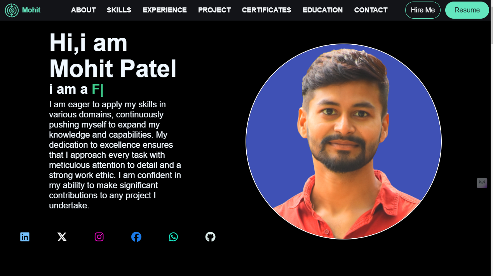
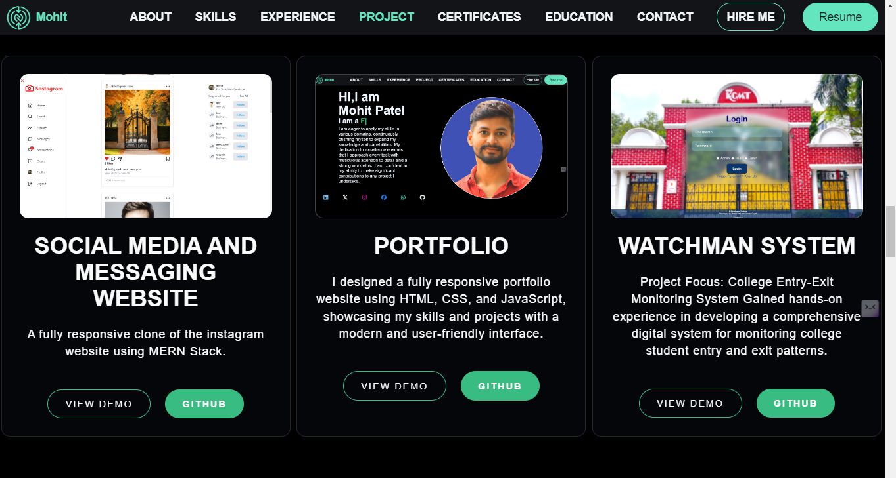

# Mohit Patel's Portfolio

A showcase of projects, skills, and experience in web development and software engineering.

## Features
- Responsive design
- Project demos and descriptions
- Interactive contact form with email functionality

## Demo
#### Homepage

#### Projects Section

## Table of Contents
- [Installation](#installation)
- [Technologies](#technologies)
- [Projects](#projects)
- [License](#license)
- [Contact](#contact)

## Installation
1. Clone the repo: `git clone https://github.com/moohiit/portfolio.git`
2. Install dependencies: `npm install`
3. Run the project: `npm start`

## Technologies
- **Frontend:** React, Tailwind CSS, Material UI
- **Backend:** Node.js, Express.js, PHP, MongoDB

## Projects
### Watchman System
A security management system at colleges...
### Social Media and Messaging Website
A full-stack application...

## License
This project is licensed under the MIT License.

## Contact
- GitHub: [moohiit](https://github.com/moohiit)
- Email: mohit.patel.edu@gmail.com
- Linkedin: [Mohit Patel](https://www.linkedin.com/in/mohit-patel-51338a245/)
